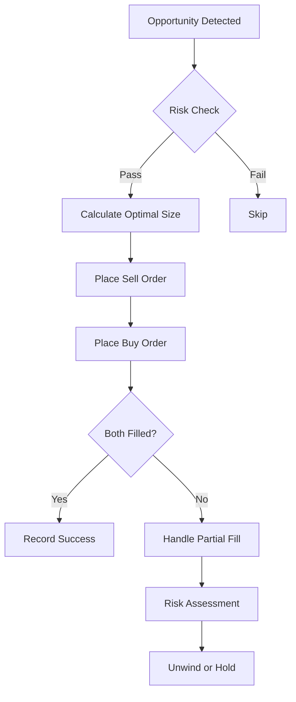

# Kalshi Arbitrage Trading System - Technical Project Outline

## Table of Contents
1. [System Architecture](#system-architecture)
2. [Project Structure](#project-structure)
3. [Development Phases](#development-phases)
4. [Technical Implementation](#technical-implementation)
5. [API Integration](#api-integration)
6. [Risk Management](#risk-management)
7. [Development Timeline](#development-timeline)

## System Architecture

### High-Level Architecture
```
┌─────────────────┐     ┌──────────────────┐     ┌─────────────────┐
│  Kalshi         │     │  Arbitrage       │     │  Trading        │
│  WebSocket API  │────▶│  Detection       │────▶│  Execution      │
│                 │     │  Engine          │     │  Engine         │
└─────────────────┘     └──────────────────┘     └─────────────────┘
         │                       │                         │
         ▼                       ▼                         ▼
┌─────────────────┐     ┌──────────────────┐     ┌─────────────────┐
│  Order Book     │     │  Opportunity     │     │  Position       │
│  Manager        │     │  Queue           │     │  Manager        │
└─────────────────┘     └──────────────────┘     └─────────────────┘
                                │
                                ▼
                        ┌──────────────────┐
                        │  Monitoring      │
                        │  Dashboard       │
                        └──────────────────┘
```

### Data Flow
1. **Market Data Ingestion**: WebSocket streams → Order Book Manager
2. **Arbitrage Detection**: Price updates → Logical validation → Opportunity identification
3. **Trade Execution**: Opportunity → Risk check → Order placement → Fill monitoring
4. **Position Management**: Fills → Position update → P&L calculation

## Project Structure

```
kalshi-arbitrage/
├── README.md
├── PROJECT_OUTLINE.md
├── LICENSE
├── .gitignore
├── .env.example
├── requirements.txt
├── requirements-dev.txt
├── setup.py
│
├── config/
│   ├── __init__.py
│   ├── settings.py              # Trading parameters and thresholds
│   ├── credentials.example.py   # Template for API credentials
│   ├── markets.yaml            # Market relationship definitions
│   └── kalshi_fees.py            # Centralized fee management    
│
├── src/
│   ├── __init__.py
│   ├── main.py                 # Application entry point
│   │
│   ├── core/
│   │   ├── __init__.py
│   │   ├── arbitrage_calculator.py    # Core arbitrage math
│   │   ├── market_relationships.py    # Logical relationship engine
│   │   ├── opportunity.py             # Opportunity data structures
│   │   └── fee_calculator.py          # Kalshi fee calculations
│   │
│   ├── data/
│   │   ├── __init__.py
│   │   ├── websocket_client.py        # WebSocket connection handler
│   │   ├── market_data_handler.py     # Message processing
│   │   ├── order_book_manager.py      # Order book maintenance
│   │   └── data_models.py             # Data structures
│   │
│   ├── trading/
│   │   ├── __init__.py
│   │   ├── trade_executor.py          # REST API trade execution
│   │   ├── order_manager.py           # Order lifecycle management
│   │   ├── position_manager.py        # Position tracking
│   │   └── risk_manager.py            # Risk controls
│   │
│   ├── strategy/
│   │   ├── __init__.py
│   │   ├── arbitrage_strategy.py      # Main strategy logic
│   │   ├── opportunity_ranker.py      # Opportunity prioritization
│   │   └── execution_optimizer.py     # Optimal sizing/timing
│   │
│   ├── monitoring/
│   │   ├── __init__.py
│   │   ├── dashboard.py               # Web-based monitoring
│   │   ├── metrics.py                 # Performance metrics
│   │   └── alerts.py                  # Alert system
│   │
│   └── utils/
│       ├── __init__.py
│       ├── logger.py                  # Logging configuration
│       ├── helpers.py                 # Utility functions
│       └── exceptions.py              # Custom exceptions
│
├── tests/
│   ├── __init__.py
│   ├── conftest.py                    # pytest configuration
│   ├── test_arbitrage_calculator.py
│   ├── test_websocket_client.py
│   ├── test_trade_executor.py
│   └── fixtures/                      # Test data
│
├── scripts/
│   ├── manual_calculator.py           # CLI arbitrage calculator
│   ├── backtest.py                    # Historical analysis
│   ├── market_scanner.py              # Market relationship finder
│   └── performance_analyzer.py        # Trading results analysis
│
├── docs/
│   ├── API.md                         # API documentation
│   ├── FAQ.md                         # Frequently asked questions
│   └── SETUP.md                       # Detailed setup guide
│
└── logs/
    └── .gitkeep
```

## Development Phases

### Phase 1: Core Arbitrage Engine (Week 1-2)

#### 1.1 Manual Calculator
```python
# scripts/manual_calculator.py
class ManualArbitrageCalculator:
    def __init__(self):
        self.fee_calculator = FeeCalculator()
    
    def calculate_arbitrage(self, market_a, market_b, prices):
        """Calculate arbitrage opportunity between two related markets"""
        # Implementation details
```

#### 1.2 Market Relationships
```python
# src/core/market_relationships.py
class MarketRelationship:
    SUBSET = "subset"           # A ⊆ B
    DISJOINT = "disjoint"       # A ∩ B = ∅
    COMPLEMENT = "complement"   # A = ¬B
    
class RelationshipEngine:
    def find_relationships(self, markets):
        """Automatically detect logical relationships"""
        # Implementation details
```

#### 1.3 Fee Integration
- Implement Kalshi's tiered fee structure
- Calculate break-even thresholds
- Support for maker/taker fees

### Phase 2: Real-Time Data Integration (Week 3-4)

#### 2.1 WebSocket Client
```python
# src/data/websocket_client.py
class KalshiWebSocketClient:
    def __init__(self, credentials):
        self.ws_url = "wss://api.elections.kalshi.com/trade-api/ws/v2"
        self.subscriptions = {}
        
    async def connect(self):
        """Establish WebSocket connection with authentication"""
        
    async def subscribe_channels(self, channels, markets):
        """Subscribe to market data channels"""
```

#### 2.2 Order Book Management
```python
# src/data/order_book_manager.py
class OrderBook:
    def __init__(self, market_ticker):
        self.bids = SortedDict()  # Price -> Quantity
        self.asks = SortedDict()  # Price -> Quantity
        self.sequence = 0
        
    def apply_snapshot(self, snapshot_msg):
        """Process orderbook_snapshot message"""
        
    def apply_delta(self, delta_msg):
        """Process orderbook_delta message"""
```

### Phase 3: Arbitrage Detection System (Week 5-6)

#### 3.1 Opportunity Detection
```python
# src/strategy/arbitrage_strategy.py
class ArbitrageDetector:
    def __init__(self, relationship_engine):
        self.relationships = relationship_engine
        self.opportunities = PriorityQueue()
        
    def on_price_update(self, market, book):
        """Check for arbitrage on each price update"""
        related_markets = self.relationships.get_related(market)
        for related in related_markets:
            opportunity = self.check_arbitrage(market, related)
            if opportunity and opportunity.profit > MIN_PROFIT:
                self.opportunities.put(opportunity)
```

#### 3.2 Optimization Engine
- Linear programming for capital allocation
- Multi-leg opportunity detection
- Transaction cost optimization

### Phase 4: Automated Trading (Week 7-8)

#### 4.1 Trade Execution
```python
# src/trading/trade_executor.py
class TradeExecutor:
    def __init__(self, api_client, risk_manager):
        self.api = api_client
        self.risk = risk_manager
        
    async def execute_arbitrage(self, opportunity):
        """Execute multi-leg arbitrage trade"""
        if not self.risk.check_limits(opportunity):
            return None
            
        orders = self.build_orders(opportunity)
        results = await self.place_orders_atomic(orders)
        return results
```

#### 4.2 Position Management
- Real-time position tracking
- P&L calculation
- Settlement handling

### Phase 5: Monitoring & Optimization (Week 9)

#### 5.1 Dashboard Development
- Real-time WebSocket dashboard
- Historical performance charts
- System health monitoring

#### 5.2 Alert System
- Telegram/Discord notifications
- Email alerts for large opportunities
- System error notifications

## Technical Implementation

### WebSocket Subscription Strategy

```python
# Priority subscriptions for arbitrage detection
CRITICAL_CHANNELS = [
    "orderbook_delta",      # Real-time book updates
    "ticker_v2",           # Price and volume changes
    "fill",                # Personal fill notifications
]

MONITORING_CHANNELS = [
    "trade",               # Public trade feed
    "market_lifecycle_v2", # Market status changes
]
```

### Arbitrage Detection Algorithm

```python
def detect_subset_arbitrage(market_a, market_b):
    """
    Detect arbitrage where market_a ⊆ market_b
    Example: "Above 400" ⊆ "Above 300"
    """
    # Get best prices
    a_yes_ask = market_a.best_ask('yes')
    b_yes_bid = market_b.best_bid('yes')
    
    # Check if A_yes > B_yes (violation)
    if a_yes_ask and b_yes_bid and a_yes_ask > b_yes_bid:
        # Arbitrage: Sell A_yes, Buy B_yes
        gross_profit = a_yes_ask - b_yes_bid
        net_profit = gross_profit - calculate_fees(a_yes_ask, b_yes_bid)
        
        if net_profit > MIN_PROFIT_THRESHOLD:
            return ArbitrageOpportunity(
                sell_market=market_a,
                buy_market=market_b,
                expected_profit=net_profit
            )
```

### Order Execution Flow



## API Integration

### WebSocket Connection Management

```python
class ConnectionManager:
    def __init__(self):
        self.reconnect_delay = 1
        self.max_reconnect_delay = 60
        
    async def maintain_connection(self):
        while True:
            try:
                await self.client.connect()
                await self.client.run()
            except Exception as e:
                await self.handle_disconnect(e)
                await asyncio.sleep(self.reconnect_delay)
                self.reconnect_delay = min(
                    self.reconnect_delay * 2, 
                    self.max_reconnect_delay
                )
```

### REST API Integration

```python
class KalshiAPIClient:
    BASE_URL = "https://api.elections.kalshi.com/v2"
    
    def __init__(self, api_key, api_secret):
        self.session = requests.Session()
        self.session.headers.update({
            'Authorization': f'Bearer {self.get_token()}'
        })
        
    async def place_order(self, market_ticker, side, quantity, price):
        """Place limit order via REST API"""
        endpoint = f"{self.BASE_URL}/orders"
        payload = {
            "market_ticker": market_ticker,
            "side": side,
            "quantity": quantity,
            "price": price,
            "type": "limit"
        }
        return await self.post(endpoint, payload)
```

## Risk Management

### Position Limits
```python
RISK_LIMITS = {
    "max_position_size": 1000,          # Max contracts per market
    "max_total_exposure": 10000,        # Max total contracts
    "max_market_concentration": 0.2,     # Max % in single market
    "daily_loss_limit": 500,            # Stop trading if exceeded
    "min_profit_threshold": 0.01,       # Min profit after fees
}
```

### Pre-Trade Checks
1. **Capital availability**: Ensure sufficient buying power
2. **Position limits**: Check market and total exposure
3. **Correlation risk**: Avoid over-concentration
4. **Market status**: Verify markets are active
5. **Liquidity check**: Ensure sufficient depth

### Post-Trade Monitoring
- Real-time P&L tracking
- Partial fill handling
- Settlement risk management
- Position unwinding strategies

## Development Timeline

### Week 1-2: Foundation
- [ ] Project setup and structure
- [ ] Manual arbitrage calculator
- [ ] Market relationship engine
- [ ] Fee calculation module

### Week 3-4: Data Integration
- [ ] WebSocket client implementation
- [ ] Order book management
- [ ] Real-time data pipeline
- [ ] Data persistence layer

### Week 5-6: Strategy Development
- [ ] Arbitrage detection algorithm
- [ ] Opportunity ranking system
- [ ] Backtesting framework
- [ ] Performance optimization

### Week 7-8: Trading System
- [ ] REST API integration
- [ ] Trade execution engine
- [ ] Position management
- [ ] Risk management implementation

### Week 9: Production Ready
- [ ] Monitoring dashboard
- [ ] Alert system
- [ ] Performance tuning
- [ ] Documentation completion
- [ ] Deployment scripts

## Performance Considerations

### Latency Optimization
- Maintain persistent WebSocket connections
- Use connection pooling for REST API
- Implement local order book caching
- Minimize arbitrage calculation time

### Scalability
- Asynchronous processing for all I/O
- Efficient data structures (sorted dicts for order books)
- Horizontal scaling for multiple market monitoring
- Queue-based opportunity processing

### Reliability
- Graceful error handling
- Automatic reconnection logic
- State persistence across restarts
- Transaction atomicity guarantees

## Next Steps

1. **Environment Setup**: Install Python, create virtual environment
2. **API Access**: Obtain Kalshi API credentials
3. **Start Development**: Begin with Phase 1 manual calculator
4. **Iterative Testing**: Test each component thoroughly
5. **Paper Trading**: Run in simulation mode before live trading

---

*This outline serves as the technical blueprint for the Kalshi Arbitrage Trading System. Each phase builds upon the previous, creating a robust and scalable trading platform.*
